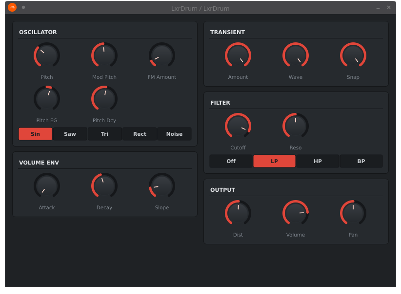
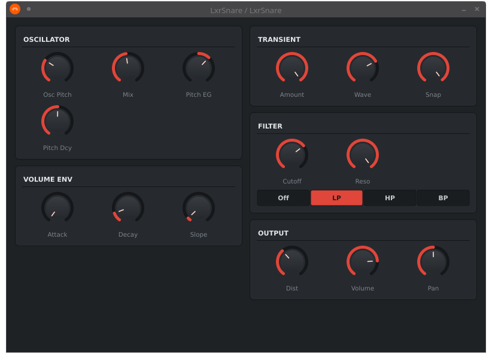
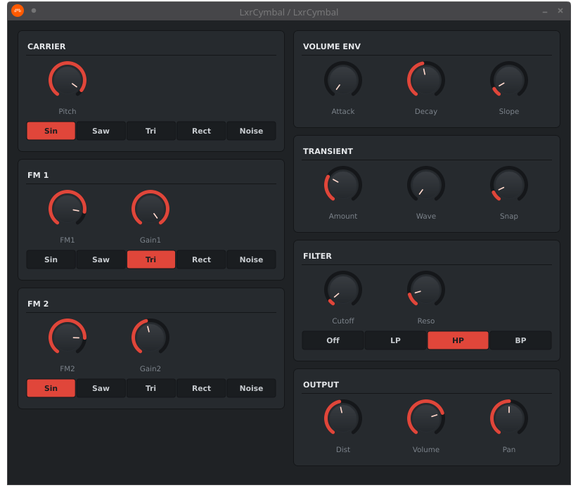
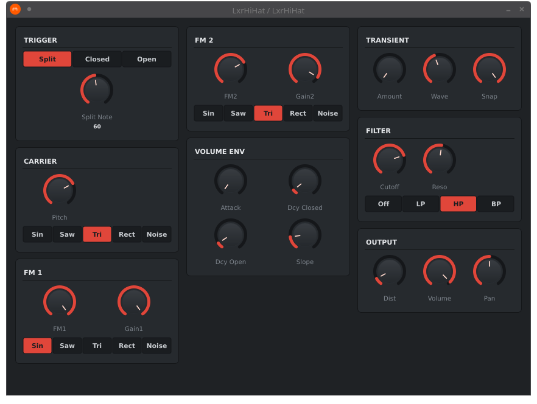
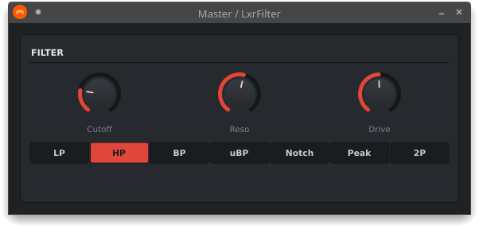
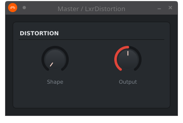

# LXR Voices CLAP

CLAP and VST3 plugins (one per voice type, plus a couple of effects) wrapping
the DSP engine of the [Sonic Potions LXR drum synthesizer](https://github.com/SonicPotions/LXR)
for use in any plugin-capable DAW.

The suite consists of six plugins:

**Voices (instruments):**
- **LxrDrum** — kick / tom / general drum voice (3-op FM with transient generator and SVF)

- **LxrSnare** — subtractive clap/snare voice with separate noise filter routing

- **LxrCymbal** — 3-operator FM percussion voice tuned for cymbal-like inharmonic content
  
- **LxrHiHat** — hi-hat voice with closed/open via parameter or note number split


**Effects (audio processors):**
- **LxrFilter** — the LXR state-variable filter as a standalone stereo effect (LP/HP/BP/Unity BP/Notch/Peak/2-Pole LP)



- **LxrDistortion** — the LXR per-voice waveshaper as a standalone effect



> [!IMPORTANT]
> ## License — read this first
>
> The original LXR firmware is **not** under a permissive open-source license.
> Every source file in `lxr_dsp/` is governed by the LXR redistribution
> terms reproduced in `lxr_dsp/LXR_LICENSE.txt`. The most important clause:
>
> > **The code may not be sold, nor may it be used in a commercial product or activity.**
>
> You can build, share, and use these plugins for free. You **cannot** sell
> them, bundle them in a paid product, or use them in commercial work without
> written permission from the original author (Julian Schmidt / Sonic Potions).
>
> All redistributions must include the LXR source you modified or built from
> — this repo satisfies that by vendoring `lxr_dsp/` rather than fetching it.
> The wrapper code under `plugins/` is yours to license however you prefer
> (or you can put it under the same terms).

## Status

- ✅ All four voice plugins working with full parameter coverage
- ✅ Two effect plugins (Filter, Distortion) extracted from the LXR per-voice DSP
- ✅ Custom GUI shared across all six plugins (dark panel, Erica red accent,
  rotary knobs, segmented choice strips for waveform / filter-type selectors)
- ✅ Logarithmic filter cutoff mapping (slider 0..1 sweeps 20 Hz..20 kHz)
- ✅ Hardware-style decay curve mapping for the hi-hat closed/open envelopes
- ✅ FM modulator parameters renamed to LXR-02 conventions (FM1/FM2/Gain1/Gain2)
- ✅ Standalone smoke test renders correct drum-like audio without a DAW
- 🚧 No effect plugins beyond Filter / Distortion (V1 firmware doesn't have
  a delay, reverb, or chorus — see "Limitations" below)

## Architecture

```
+-------------------------+        +---------------------------+
| Host (DAW)              |        | Lxr<Voice>.clap           |
|                         |        |                           |
|  MIDI note-on  ---------+------->|  PluginProcessor          |
|  parameter change  -----+------->|    AudioProcessorValueTreeState
|                         |        |    |                      |
|  audio out  <-----------+--------+    v                      |
|                         |        |  Lxr<Voice>Engine (C++)   |
+-------------------------+        |    |                      |
                                   |    +--> writes voice struct fields
                                   |    +--> calls calc<Voice>SyncBlock
                                   |    +--> int16 -> float, 32-sample
                                   |         block accumulator
                                   +---------------------------+
                                              |
                                              v
                                   +---------------------------+
                                   |  lxr_dsp/  (vendored C)   |
                                   |    DrumVoice / Snare /    |
                                   |    CymbalVoice / HiHat    |
                                   |    + Oscillator / SVF /   |
                                   |    + LFO / Distortion /   |
                                   |    + transient gen / etc. |
                                   +---------------------------+
```

The LXR voices process at a fixed **32-sample block** with **int16** output. The
plugin wraps this in a small accumulator: when the host asks for N float
samples, the wrapper calls the LXR sync function as many times as needed,
converts each int16 result to float, and emits into the host buffer. Trailing
samples are kept across host blocks so block size mismatches between host and
LXR are absorbed cleanly.

## Build

### Prerequisites

- CMake 3.22+
- C/C++17 compiler (GCC, Clang, MSVC)
- Network access for the JUCE 8 and clap-juce-extensions submodules

On CachyOS / Arch:
```
sudo pacman -S base-devel cmake git \
               alsa-lib jack2 freetype2 \
               libx11 libxrandr libxinerama libxcursor libxext \
               mesa libglvnd pkgconf
```

On Debian / Ubuntu:
```
sudo apt install build-essential cmake git \
                 libasound2-dev libjack-jackd2-dev libfreetype6-dev \
                 libx11-dev libxrandr-dev libxinerama-dev libxcursor-dev libxext-dev \
                 libgl1-mesa-dev pkg-config
```

### One-time setup

```bash
git clone <this-repo> lxr-voices-clap
cd lxr-voices-clap
git submodule update --init --recursive
```

…or fetch JUCE 8 and clap-juce-extensions manually into `third_party/`.

### Configure & build

```bash
cmake -B build -DCMAKE_BUILD_TYPE=Release
cmake --build build -j$(nproc)
```

### Install (per-user)

CLAP files land in `build/plugins/<name>/Lxr<Name>_artefacts/Release/CLAP/`.
Copy them to your CLAP plugin directory:

- **Linux**: `~/.clap/`
- **macOS**: `~/Library/Audio/Plug-Ins/CLAP/`
- **Windows**: `%LOCALAPPDATA%\Programs\Common\CLAP\`

One-liner for Linux:

```bash
for p in drum snare cymbal hihat fx_filter fx_distortion; do
  case $p in
    fx_filter)     cls=LxrFilter ;;
    fx_distortion) cls=LxrDistortion ;;
    *)             cls=Lxr$(echo $p | sed 's/.*/\u&/') ;;
  esac
  cp build/plugins/$p/${cls}_artefacts/Release/CLAP/${cls}.clap ~/.clap/
done
```

VST3 builds also land in the same `_artefacts` directory if your host prefers
that format.

## Plugin reference

### LxrDrum (800 × 560)

The 3-operator FM voice as featured in the original LXR. Two columns:

- **Left**: Oscillator (Pitch, Mod Pitch, FM Amount, Pitch EG, Pitch Decay,
  Waveform strip), Volume Env (Attack, Decay, Slope)
- **Right**: Transient (Amount, Wave, Snap), Filter (Cutoff, Reso, Type strip),
  Output (Dist, Volume, Pan)

Best as a kick or tom. Snap + low Pitch Decay + high FM Amount produces strong
electronic kick character; raise Mod Pitch and Pitch EG for tonal variety.

### LxrSnare (800 × 560)

Subtractive snare voice: tonal oscillator + filtered noise oscillator, mixed.
Note that **only the noise oscillator passes through the filter** — the
firmware design choice that lets you shape rattle / sizzle without dulling the
drum body. Two columns matching the drum layout.

### LxrCymbal (800 × 660)

Pure 3-op FM voice tuned for inharmonic content. Three modulators on the left
(Carrier, FM 1, FM 2 — each with its own waveform strip), envelope / transient /
filter / output on the right. FM 2 defaults to Noise to give the metallic
cymbal character; switch to Sine for cleaner FM bell tones.

### LxrHiHat (860 × 620, 3-column layout)

The most parameter-heavy plugin. Three columns:

- **Left**: Trigger (Split / Closed / Open mode + Split Note knob with value
  display), Carrier, FM 1
- **Middle**: FM 2, Volume Env (Attack, Decay Closed, Decay Open, Slope —
  laid out as a 2×2 grid)
- **Right**: Transient, Filter, Output

In **Note Split** mode, MIDI notes below the Split Note value trigger as
closed hi-hat (using Decay Closed); notes at or above the split trigger as
open (using Decay Open). The Split Note knob shows the current MIDI value
inline so you can tell what's set without dragging.

### LxrFilter (580 × 240, audio effect)

The full LXR state-variable filter as a standalone stereo effect. Single
section with Cutoff, Resonance, Drive knobs and a 7-segment Type strip:

- LP / HP / BP / Unity BP / Notch / Peak / 2-Pole LP

The "2-Pole LP" mode is the firmware's separate algorithm for kick-drum
transient preservation — try it on punchy material that the regular LP
softens too much.

### LxrDistortion (340 × 200, audio effect)

The LXR waveshaper as a stereo effect. Two knobs: Shape (saturation curve
intensity) and Output (level trim, 0.5 = unity, useful because heavy Shape
values push the level up).

## How the GUI works

All six plugins share a common look-and-feel built from three header-only
components in `plugins/shared/`:

- **Theme.h** — color and size constants. To change the accent color suite-wide,
  edit `knobFill` and `segBgOn` in this file.
- **LxrLookAndFeel.h** — JUCE LookAndFeel that draws the rotary knobs (track
  arc, value-fill arc, knob body, pointer line). Bipolar parameters fill from
  center outward.
- **Components.h** — `LabeledKnob`, `SegmentedChoice`, `SectionHeader`. The
  `LabeledKnob` constructor takes an optional `showValueText` flag that adds a
  small live value readout below the label (used for the hi-hat Split Note).

Each plugin's `PluginEditor.{h,cpp}` composes these into a layout. Window sizes
are fixed (per-plugin) so hosts open them at the right size with no scrolling.

## Filter cutoff curve

Cutoff knobs use a logarithmic mapping so the slider sweeps ~10 octaves
(20 Hz to 20 kHz) evenly:

| Slider | Cutoff at 44.1 kHz |
|--------|--------------------|
| 0.00   | 20 Hz |
| 0.25   | 112 Hz |
| 0.50   | 632 Hz |
| 0.75   | 3.5 kHz |
| 1.00   | 19.8 kHz (fully open) |

This applies to all five plugins with a Cutoff knob (drum, snare, cymbal,
hihat, fx_filter). Mapping helper lives in
`plugins/shared/LxrEngineBase.h::cutoffSliderToSvfInput()`.

## Hi-hat decay curve

The hi-hat's closed and open decay knobs route through the firmware's
exponential time-curve helper (`slopeEg2_calcDecay`), the same curve the
hardware unit uses on its decay-time dial:

| Slider | Decay time |
|--------|-----------|
| 0.05   | ~75 ms (tight closed hat) |
| 0.10   | ~166 ms (default closed) |
| 0.40   | ~1 s (default open) |
| 0.70   | ~3.4 s (washy long open) |
| 1.00   | held forever |

Most musical territory is in the lower portion of the slider — the upper end
is intentionally for sustained / unrealistic effects.

## Testing without a DAW

A standalone test driver triggers each voice and writes a 2-second WAV:

```bash
cmake --build build --target lxr_voice_test
./build/test/lxr_voice_test
```

Output: `build/test/lxr_voices.wav`.

## Project layout

```
lxr-voices-clap/
├── README.md                  -- this file
├── CMakeLists.txt             -- top-level: discovers JUCE, builds all six plugins + test
├── lxr_dsp/                   -- vendored LXR source (license requires this)
│   ├── LXR_LICENSE.txt
│   ├── compat/                -- portability shims
│   │   ├── stm32f4xx.h        -- stdint typedefs + INCCM stubs
│   │   └── arm_intrinsics_compat.h  -- portable __QADD16 etc. for x86
│   ├── stubs/                 -- replacements for hardware-only modules
│   ├── SampleRom/SampleMemory.{c,h}  -- user-sample stubs (zeroed buffer)
│   ├── DSPAudio/              -- the real DSP engine (only random.c modified)
│   └── ...
├── plugins/
│   ├── shared/
│   │   ├── BlockAccumulator.h   -- 32-sample int16<->float bridge
│   │   ├── LxrEngineBase.h      -- global init + cutoff curve helper
│   │   ├── Theme.h              -- colors and sizes
│   │   ├── LxrLookAndFeel.h     -- rotary knob drawing
│   │   └── Components.h         -- LabeledKnob, SegmentedChoice, SectionHeader
│   ├── drum/                  -- LxrDrum (CMake target + processor + editor + engine)
│   ├── snare/                 -- LxrSnare
│   ├── cymbal/                -- LxrCymbal
│   ├── hihat/                 -- LxrHiHat
│   ├── fx_filter/             -- LxrFilter
│   └── fx_distortion/         -- LxrDistortion
├── test/
│   └── lxr_voice_test.c       -- standalone smoke test (no JUCE dep)
└── third_party/
    ├── JUCE/                  -- submodule
    └── clap-juce-extensions/  -- submodule
```

## Adding another voice or effect

Each plugin is a self-contained directory with the same skeleton:

1. **`<Name>Engine.{h,cpp}`** — wraps the LXR voice or DSP module. Uses
   `BlockAccumulator` if the underlying DSP wants 32-sample int16 blocks.
   Reads from the LXR voice struct directly for state, calls the LXR's
   setter functions for parameter updates.
2. **`PluginProcessor.{h,cpp}`** — JUCE `AudioProcessor`. Defines the
   APVTS parameter layout, pushes parameter values to the engine on each
   processBlock, returns the new editor from `createEditor()`.
3. **`PluginEditor.{h,cpp}`** — JUCE `AudioProcessorEditor`. Lays out
   `LabeledKnob` and `SegmentedChoice` widgets in sections.
4. **`CMakeLists.txt`** — calls `juce_add_plugin` and links `lxr_dsp_lib`.

Then add the new directory to the top-level `CMakeLists.txt`:

```cmake
add_subdirectory (plugins/<name>)
```

## Known limitations / quirks

- **Sample rate**: the LXR runs at 44100 Hz internally. We do *not* resample.
  If your host is at 48 kHz the voices will play 8.8% slower / lower than
  on hardware. Stick to 44.1k sessions for authentic LXR feel.
- **Block size**: fixed at 32 samples internally. Host block size is decoupled
  via the `BlockAccumulator`, so any host block size works.
- **Polyphony**: each plugin instance is **monophonic**. Trigger a new note
  before the previous decays and the voice will retrigger. For polyphony,
  load multiple instances.
- **User samples**: factory wavetables (sine, saw, tri, rect, noise) and the
  embedded crash sample work; SD-card user samples don't because we replaced
  the SD/flash backing with a zeroed buffer. Sample slots 5 and 6 (which
  correspond to user samples on hardware) are dropped from waveform dropdowns.
- **No delay / reverb / chorus**: the V1 LXR firmware doesn't have these. The
  V2 LXR-02 does, but its firmware is closed-source and we can't extract them.
  If you want time-based effects on the LXR signal chain, use third-party
  plugins.
- **No "Bitcrush" parameter**: the V1 firmware has a `decimationRate` field
  on each voice but never reads it in the render code. We don't expose it to
  avoid a misleading no-op control.
- **Tempo-synced LFO**: the LFO's rate-from-bpm path works if the host
  reports tempo via JUCE's `getPlayHead()`. The plugins call `lxr_setBpmFloat()`
  with the host's tempo on each block.

## Acknowledgments

All DSP credit goes to **Julian Schmidt** (Sonic Potions) and contributors to
the original LXR firmware. This project is a wrapper, not a re-implementation —
the actual sound generation is byte-for-byte the same code that runs on the
hardware unit.

The Erica Synths LXR-02 and LXR Eurorack Module are extensions of the V1
firmware with additional effects and features. This project is built on the
V1 source only; we use the LXR-02 manual for parameter naming conventions
where they overlap (FM1/FM2/Gain1/Gain2), but no V2-only features are
implemented.
